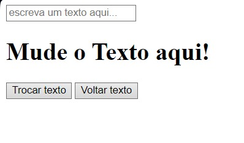
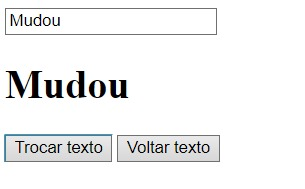
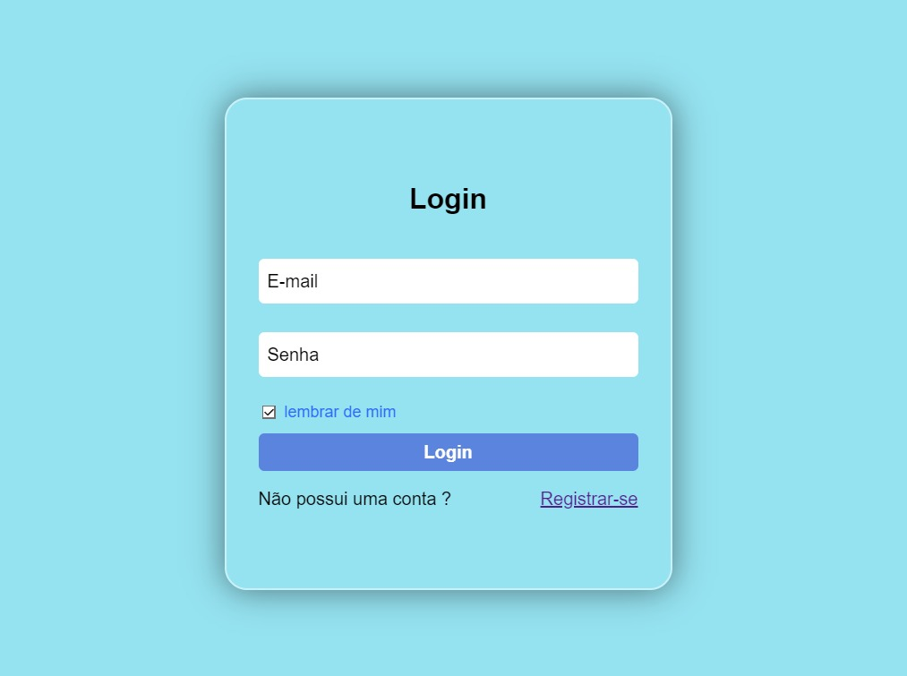
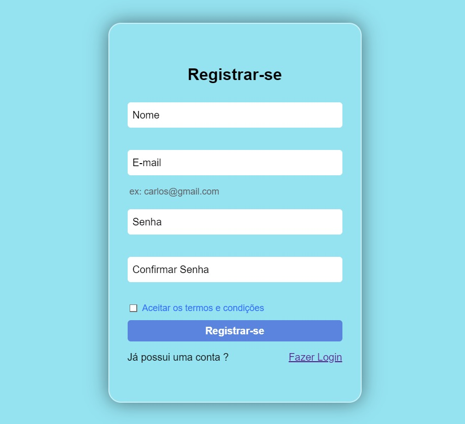

# Study-oriented repository

> Status: studying...

###Repository created to show exercises that I am performing for study purposes. Focused on always improving my knowledge to add even more to my growth as a web developer.

### In this repository, you will find several exercises, from the simplest to the most complex.

exercise 1:

  

    
    

exercise 2:

    
    

